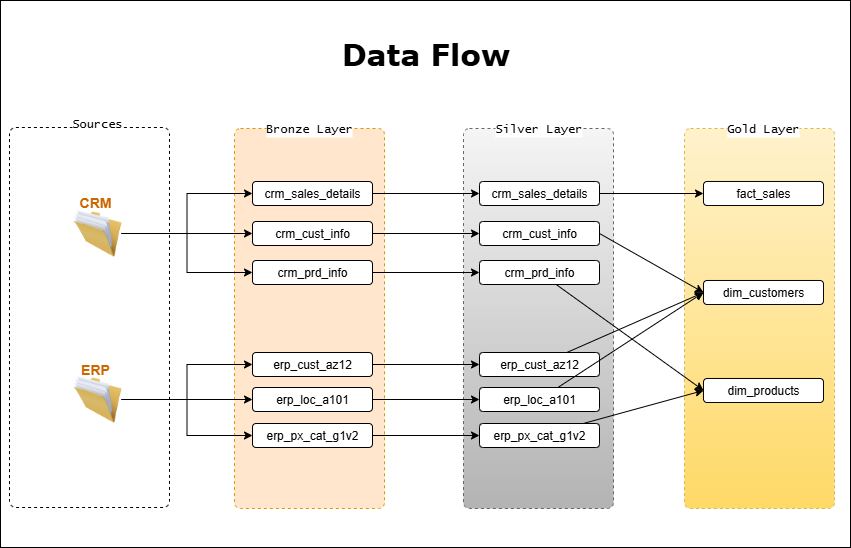

# Data Warehouse Project

Welcome to the **Data Warehouse Project** repository! 🚀  
This project demonstrates a complete data warehousing and analytics solution, from building the warehouse to generating actionable insights. Designed as a portfolio project, it highlights industry best practices in data engineering, modeling, and reporting.

---
## 🏗️ Data Architecture

The data architecture for this project follows Medallion Architecture **Bronze**, **Silver**, and **Gold** layers:

1. **Bronze Layer**: Captures raw data ingested from source systems (CSV files → SQL Server).
2. **Silver Layer**: Applies cleansing, standardization, and normalization to prepare data for downstream use.
3. **Gold Layer**: Delivers curated, business-ready data modeled into a star schema for reporting and analytics.

---
## 📖 Project Overview

This project involves:

1. **Data Architecture**: Designing a data warehouse using the **Bronze–Silver–Gold** framework.
2. **ETL Pipelines**: Extracting, transforming, and loading data from source systems into the warehouse.
3. **Data Modeling**: Creating fact and dimension tables optimized for analytical workloads.
4. **Analytics & Reporting**: Delivering SQL-based reports and dashboards with actionable business insights.

🎯 This repository is an excellent resource for professionals and students looking to showcase expertise in:
- SQL Development
- Data Architect
- Data Engineering  
- ETL Pipeline Developer  
- Data Modeling  
- Data Analytics  

---

## 🚀 Project Requirements

### Building the Data Warehouse (Data Engineering)

#### Objective
Develop a modern data warehouse using SQL Server to consolidate sales data, enabling analytical reporting and informed decision-making.

#### Specifications
- **Data Sources**: Import data from two source systems (ERP and CRM) provided as CSV files.
- **Data Quality**: Clean and resolve quality issues before making data available for analysis.
- **Integration**: Merge both sources into a single, intuitive analytical data model.
- **Scope**: Focus on the latest dataset only (historization not required).
- **Documentation**: Provide clear data model documentation for analysts and business users.

---

### BI: Analytics & Reporting (Data Analysis)

#### Objective
Develop SQL-based analytics to deliver detailed insights into:
- **Customer Behavior**
- **Product Performance**
- **Sales Trends**

These insights empower stakeholders with key business metrics, enabling strategic decision-making.
